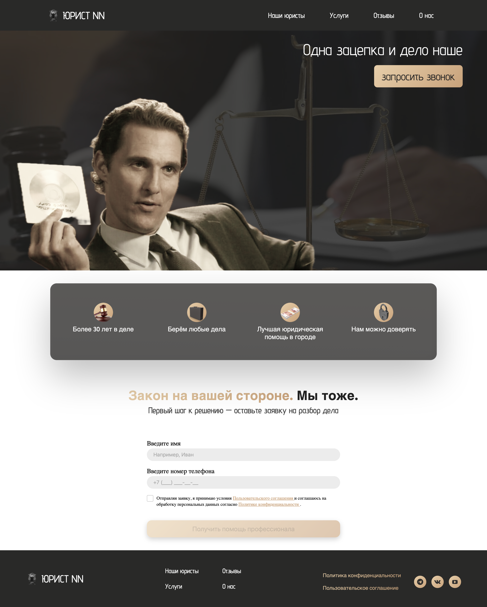
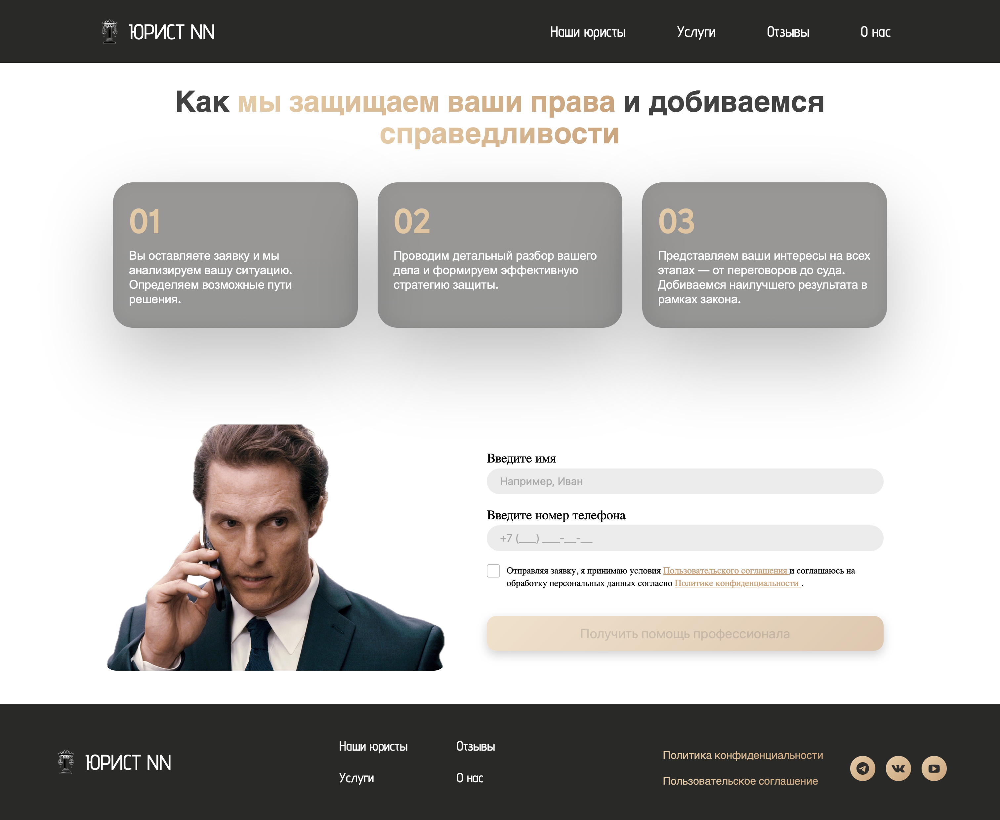
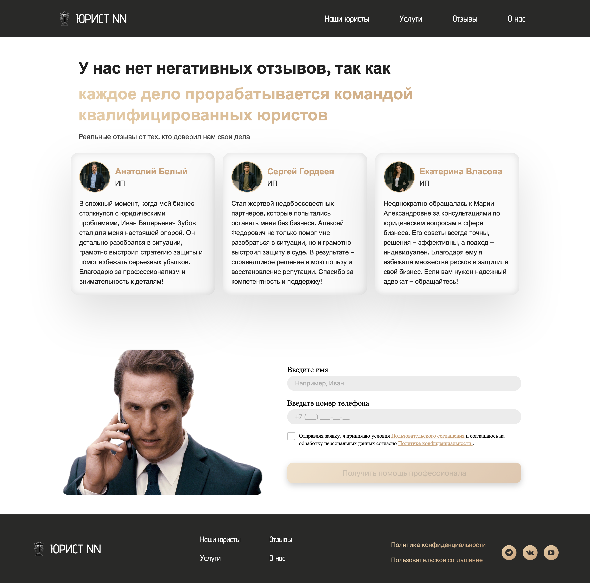
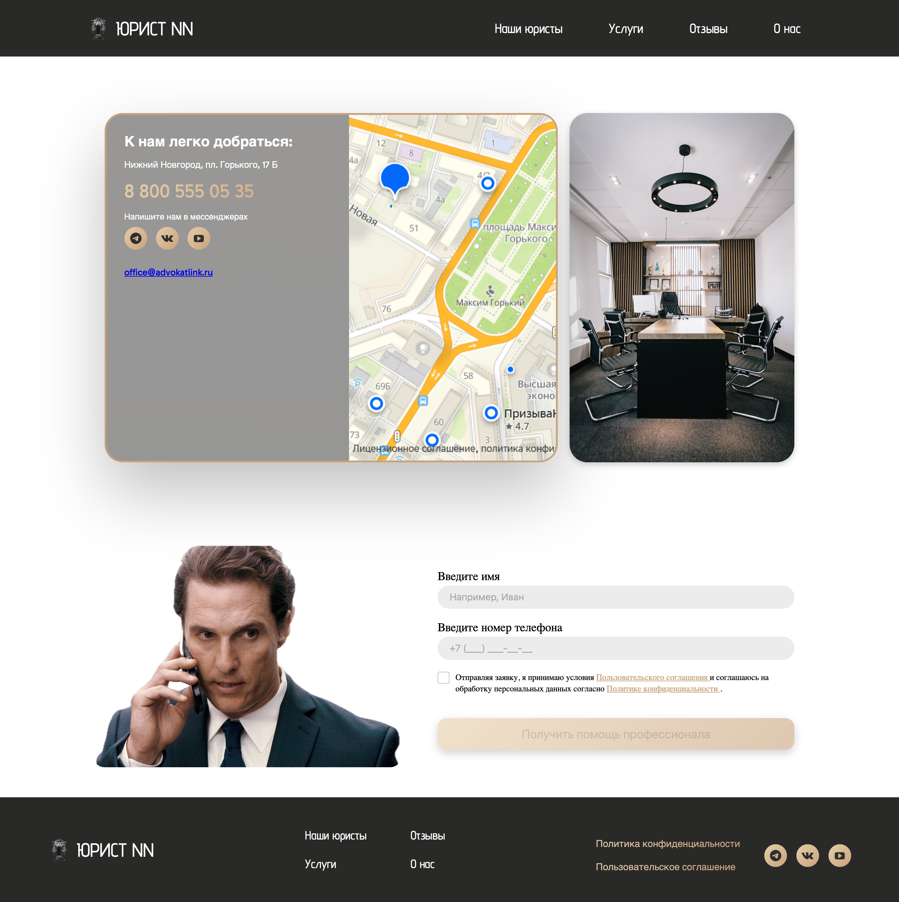
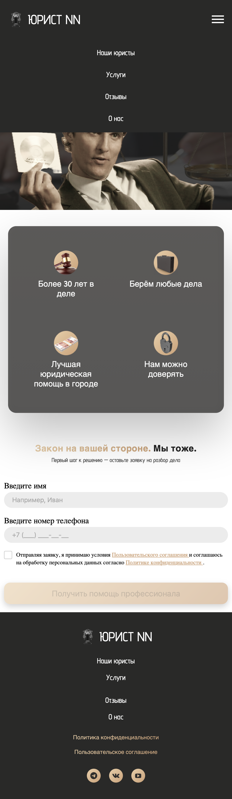

# ⚖️ ЮРИСТ NN — Профессиональные юридические услуги

[](https://antgalanin06.github.io/Lawyer_website/)

## 📋 О проекте

ЮРИСТ NN — это современный многостраничный сайт юридической компании. Платформа предлагает полный спектр юридических услуг с удобной навигацией, детальной информацией о команде специалистов и профессиональной системой обратной связи.

### 🚀 Основные возможности

- 👥 Подробные профили юристов с фильтрацией по специализации
- ⚖️ Полный каталог юридических услуг
- ⭐ Система отзывов клиентов
- 📊 Статистика успешных дел и достижений
- 📱 Полностью адаптивный дизайн
- ⚡ Быстрая загрузка и оптимизированная производительность
- 🔒 Модальные окна с политикой конфиденциальности
- 📞 Удобные формы обратной связи

## 🛠️ Технологии

<div align="center">
  
  
  
  
  
  
</div>

### Frontend
- **Vue.js 3** - современный фреймворк для создания пользовательских интерфейсов
- **Vue Router** - маршрутизация для многостраничного приложения
- **JavaScript (ES6+)** - основной язык программирования
- **HTML5** - семантическая разметка
- **CSS3** - стилизация с градиентами и анимациями
- **Vite** - быстрый сборщик проекта

### Адаптивность
- 📱 Мобильная версия (до 768px)
- 📱 Планшетная версия (768px - 1000px)
- 🖥️ Десктопная версия (от 1000px)
- 🎯 Поддержка всех современных браузеров

## 🖼️ Скриншоты

### 🏠 Главная страница
<div align="center">
  
</div>

### 📱 Страницы сайта
<div style="display: grid; grid-template-columns: 48% 48%; gap: 4%; justify-content: center;">
  <div>
    
    
  </div>
  <div>
    
    
  </div>
</div>

### 📱 Мобильная версия
<div align="center">
  
</div>

## 🏗️ Структура проекта

```
Lawyer_website/
├── .github/               # GitHub конфигурация
│   └── workflows/        # GitHub Actions
│       └── deploy.yml    # Автодеплой на GitHub Pages
│
├── .vscode/              # Настройки VS Code
│   └── extensions.json   # Рекомендуемые расширения
│
├── public/               # Публичные ассеты
│   └── images/          # Изображения
│       ├── lawyers/     # Фотографии специалистов
│       ├── icons/       # Логотипы, соцсети, офис
│       ├── hero/        # Баннеры и фоны
│       └── screens/     # Скриншоты для документации
│
├── src/                  # Исходный код
│   ├── components/      # Vue-компоненты
│   │   ├── AdvantagesBlock.vue      # Блок преимуществ
│   │   ├── CallRequestForm.vue      # Форма обратной связи
│   │   ├── ContactInfoBlock.vue     # Контактная информация
│   │   ├── Footer.vue               # Подвал сайта
│   │   ├── Header.vue               # Шапка с навигацией
│   │   ├── HeroBanner.vue           # Главный баннер
│   │   ├── LawyerList.vue           # Список юристов
│   │   ├── LegalStatistics.vue      # Статистика компании
│   │   ├── PrivacyPolicyModal.vue   # Политика конфиденциальности
│   │   ├── ReviewsBlock.vue         # Отзывы клиентов
│   │   ├── ServicesStepsBlock.vue   # Этапы работы
│   │   └── UserAgreementModal.vue   # Пользовательское соглашение
│   │
│   ├── pages/          # Страницы приложения
│   │   ├── Home.vue    # Главная страница
│   │   ├── About.vue   # О компании
│   │   ├── Lawyers.vue # Наши юристы
│   │   ├── Services.vue# Услуги
│   │   └── Reviews.vue # Отзывы
│   │
│   ├── router/         # Роутинг
│   │   └── index.js    # Конфигурация маршрутов
│   │
│   ├── App.vue         # Корневой компонент
│   └── main.js         # Точка входа
│
├── index.html          # Главный HTML
├── package.json        # Зависимости и скрипты
├── package-lock.json   # Фиксация версий зависимостей
├── vite.config.js      # Конфигурация Vite
├── jsconfig.json       # Конфигурация JavaScript
├── .gitignore         # Игнорируемые файлы
├── LICENSE            # MIT лицензия
└── README.md          # Документация
```

## 🚀 Быстрый старт

1. **Клонируйте репозиторий:**
   ```bash
   git clone https://github.com/AntGalanin06/Lawyer_website.git
   cd Lawyer_website
   ```

2. **Установите зависимости:**
   ```bash
   npm install
   ```

3. **Запустите проект:**
   ```bash
   npm run dev
   ```

## ✨ Особенности реализации

### Frontend
- 🎨 Современный дизайн с золотистыми градиентами
- 📱 Адаптивная верстка для всех устройств
- ⚡ Оптимизированная производительность с Vite
- 🔍 SEO-friendly структура
- 🎯 Интуитивный UX/UI
- 🚀 SPA с поддержкой истории браузера

### ℹ️ Контакты

Связаться со мной можно через Telegram или по электронной почте:

[](https://t.me/ant_gn)  
[](mailto:info@galanin-nn.ru)